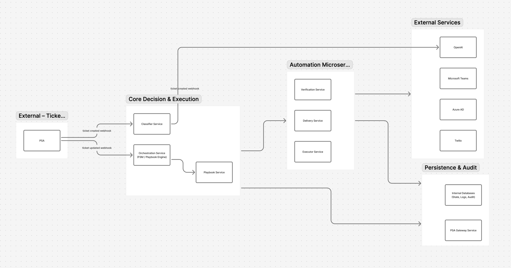

# Service Endpoints Reference – Quick Guide for Co-Founders
## System Architecture



---

## 1. Classifier Service
**Role:** Analyzes tickets, decides if they should be automated

| Endpoint | Method | Purpose |
|----------|--------|---------|
| `/api/v1/classify_ticket` | POST | Classify ticket intent & determine if automatable |
| `/api/v1/classify_ticket/{ticket_id}` | GET | Get classification result for a ticket |
| `/health` | GET | Service health check |

**Example Input:**
```json
{
  "ticket_id": "HLP-12345",
  "subject": "I can't log in",
  "body": "Password doesn't work",
  "user_email": "john.doe@company.com"
}
```

**Example Output:**
```json
{
  "automated": true,
  "playbook_id": "password_reset",
  "confidence": 0.95,
  "context": {
    "user_manager_email": "jane.smith@company.com",
    "user_department": "Engineering"
  }
}
```

---

## 2. Playbook Service
**Role:** Stores and manages workflow definitions (playbooks)

| Endpoint | Method | Purpose |
|----------|--------|---------|
| `/api/v1/playbooks/{playbook_id}` | GET | Fetch playbook definition (YAML) |
| `/api/v1/playbooks/{playbook_id}/version/{version}` | GET | Get specific playbook version |
| `/api/v1/playbooks` | POST | Create new playbook (admin only) |
| `/api/v1/playbooks/{playbook_id}` | PUT | Update playbook |
| `/api/v1/playbooks/{playbook_id}/activate` | PUT | Activate a playbook version |
| `/api/v1/playbooks/{playbook_id}/disable` | PUT | Disable a playbook |
| `/api/v1/playbooks` | GET | List all playbooks |
| `/health` | GET | Service health check |

**Example Output (GET):**
```json
{
  "name": "password_reset",
  "version": "1.2",
  "enabled": true,
  "steps": [
    { "id": "verify_mfa", "service": "verification.mfa", "timeout": 300, ... },
    { "id": "reset_password", "service": "executor.reset_password", ... }
  ]
}
```

---

## 3. Orchestration Service
**Role:** Executes playbooks step-by-step, orchestrates all microservices

| Endpoint | Method | Purpose |
|----------|--------|---------|
| `/api/v1/orchestration/execute_playbook` | POST | Start playbook execution for a ticket |
| `/api/v1/orchestration/execution/{ticket_id}` | GET | Get current execution status |
| `/api/v1/orchestration/execution/{ticket_id}/cancel` | POST | Cancel running execution |
| `/api/v1/orchestration/execution/{ticket_id}/retry` | POST | Retry failed execution |
| `/api/v1/orchestration/executions` | GET | List all executions (with filters) |
| `/health` | GET | Service health check |

**Example Input:**
```json
{
  "ticket_id": "HLP-12345",
  "playbook_id": "password_reset",
  "context": { "user_email": "john.doe@company.com", ... }
}
```

**Example Output (GET status):**
```json
{
  "ticket_id": "HLP-12345",
  "status": "running",
  "current_step": "verify_mfa",
  "steps_completed": 0,
  "steps_total": 3,
  "started_at": "2026-01-07T15:30:00Z"
}
```

---

## 4. Verification Service
**Role:** Handles identity verification (MFA + manager approval)

| Endpoint | Method | Purpose |
|----------|--------|---------|
| `/api/v1/verification/mfa` | POST | Trigger MFA push to user |
| `/api/v1/verification/mfa/{request_id}` | GET | Check MFA status (approved/denied/pending) |
| `/api/v1/verification/manager_approval` | POST | Send approval request to manager (Teams) |
| `/api/v1/verification/manager_approval/{request_id}` | GET | Check manager approval status |
| `/api/v1/verification/manager_approval/{request_id}/sms_fallback` | POST | Send SMS fallback to manager |
| `/health` | GET | Service health check |

**Example Input (MFA):**
```json
{
  "ticket_id": "HLP-12345",
  "user_id": "abc-123",
  "timeout_seconds": 300
}
```

**Example Input (Manager Approval):**
```json
{
  "ticket_id": "HLP-12345",
  "manager_email": "jane.smith@company.com",
  "action_type": "password_reset",
  "user_name": "John Doe"
}
```

---

## 5. Executor Service
**Role:** Performs sensitive actions (password resets, access provisioning, etc.)

| Endpoint | Method | Purpose |
|----------|--------|---------|
| `/api/v1/executor/reset_password` | POST | Reset user password, create TAP |
| `/api/v1/executor/unlock_account` | POST | Unlock disabled user account |
| `/api/v1/executor/revoke_sessions` | POST | Force sign-out of all user sessions |
| `/api/v1/executor/grant_access` | POST | Add user to AD group or assign license |
| `/api/v1/executor/revoke_access` | POST | Remove user from AD group |
| `/api/v1/executor/trigger_device_script` | POST | Run RMM script on user's device |
| `/health` | GET | Service health check |

**Example Input (Reset Password):**
```json
{
  "ticket_id": "HLP-12345",
  "user_id": "abc-123",
  "method": "tap",
  "tap_lifetime_minutes": 60
}
```

**Example Output:**
```json
{
  "status": "success",
  "credential": "ABCD1234EFGH5678",
  "expires_at": "2026-01-07T16:30:00Z",
  "delivery_method": "sms"
}
```

---

## 6. Delivery Service
**Role:** Sends credentials to users (SMS, email, Teams)

| Endpoint | Method | Purpose |
|----------|--------|---------|
| `/api/v1/delivery/sms` | POST | Send credential via SMS |
| `/api/v1/delivery/email` | POST | Send credential via email |
| `/api/v1/delivery/teams` | POST | Send credential via Teams DM |
| `/api/v1/delivery/{delivery_id}` | GET | Check delivery status |
| `/api/v1/delivery/{delivery_id}/retry` | POST | Retry failed delivery |
| `/health` | GET | Service health check |

**Example Input:**
```json
{
  "ticket_id": "HLP-12345",
  "user_phone": "+441234567890",
  "credential": "ABCD1234EFGH5678",
  "message": "Your temporary access code: {credential}"
}
```

**Example Output:**
```json
{
  "status": "sent",
  "delivery_id": "dlv-789xyz",
  "sent_at": "2026-01-07T15:35:00Z",
  "medium": "sms"
}
```

---

## 7. Playbook Service – Admin Endpoints
**Role:** Playbook management (CRUD operations)

| Endpoint | Method | Purpose |
|----------|--------|---------|
| `/admin/v1/playbooks` | POST | Create new playbook |
| `/admin/v1/playbooks/{playbook_id}` | PUT | Update playbook definition |
| `/admin/v1/playbooks/{playbook_id}` | DELETE | Delete playbook |
| `/admin/v1/playbooks/{playbook_id}/validate` | POST | Validate playbook syntax |
| `/admin/v1/playbooks/{playbook_id}/versions` | GET | List all versions |
| `/admin/v1/playbooks/{playbook_id}/version/{version}/rollback` | POST | Rollback to previous version |

---

## 8. Webhooks (Inbound – Our System Receives)
**Role:** External systems notify us of events

| Webhook | Source | Purpose |
|---------|--------|---------|
| `POST /webhooks/halopsa/ticket_created` | HaloPSA | New ticket created → trigger Classifier |
| `POST /webhooks/halopsa/ticket_updated` | HaloPSA | Ticket updated → trigger Orchestration (if automated) |
| `POST /webhooks/teams/approval_action` | Microsoft Teams | Manager approved/denied request |
| `POST /webhooks/twilio/sms_response` | Twilio | User replied to SMS (approval/code entry) |
| `POST /webhooks/azuread/mfa_response` | Azure AD | MFA challenge approved/denied |

---

## 9. Health & Observability
**All services expose:**

| Endpoint | Method | Purpose |
|----------|--------|---------|
| `/health` | GET | Service alive check |
| `/metrics` | GET | Prometheus metrics (latency, errors, queue depth) |
| `/logs` | GET | Recent service logs (admin only) |
| `/ready` | GET | Service ready to accept traffic (K8s readiness probe) |

---

## 10. Database/Audit Endpoints (Internal)
**Role:** Query execution history and audit logs

| Endpoint | Method | Purpose |
|----------|--------|---------|
| `/api/v1/audit/executions` | GET | List all playbook executions |
| `/api/v1/audit/executions/{ticket_id}` | GET | Get full execution history for ticket |
| `/api/v1/audit/classifications/{ticket_id}` | GET | Get classification decision log |
| `/api/v1/audit/steps/{execution_id}` | GET | Get step-by-step execution details |
| `/api/v1/audit/escalations` | GET | List escalated tickets |

---

## Quick Reference Matrix

| Service | #Endpoints | Key Action | Status Check |
|---------|-----------|-----------|--------------|
| **Classifier** | 3 | POST /classify_ticket | GET /health |
| **Playbook** | 8 | GET /playbooks/{id} | GET /health |
| **Orchestration** | 6 | POST /execute_playbook | GET /health |
| **Verification** | 6 | POST /mfa or /manager_approval | GET /health |
| **Executor** | 7 | POST /reset_password | GET /health |
| **Delivery** | 6 | POST /sms | GET /health |
| **Webhooks** | 5 | — | — |
| **Audit** | 5 | GET /executions | — |

---

## Critical Data Flow

```
1. HaloPSA creates ticket
   ↓
2. Webhooks → /webhooks/halopsa/ticket_created
   ↓
3. POST /api/v1/classify_ticket
   ↓
4. Classifier updates HaloPSA
   ↓
5. HaloPSA webhook → /webhooks/halopsa/ticket_updated (if automated=true)
   ↓
6. POST /api/v1/orchestration/execute_playbook
   ↓
7. Orchestration calls:
   - POST /api/v1/verification/mfa
   - POST /api/v1/executor/reset_password
   - POST /api/v1/delivery/sms
   ↓
8. Results logged to database
   ↓
9. GET /api/v1/audit/executions/{ticket_id}
```

---

## Usage Notes for Co-Founders

- **All endpoints return JSON**
- **Async operations return `*_id` for polling** (e.g., `mfa_request_id`)
- **All services have `/health` for uptime monitoring**
- **Admin endpoints require authentication** (token/API key)
- **Rate limiting: 100 req/min per service by default**
- **Retry logic:** Orchestration auto-retries failed steps per playbook config
- **Timeouts:** All orchestration steps have configurable timeout (min 30s, max 600s)
